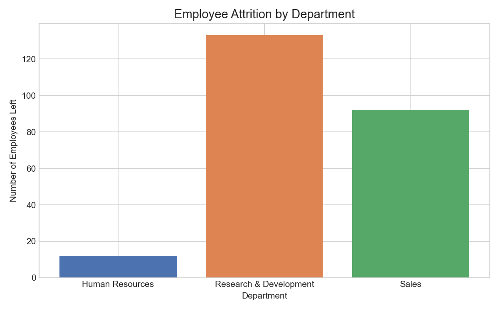
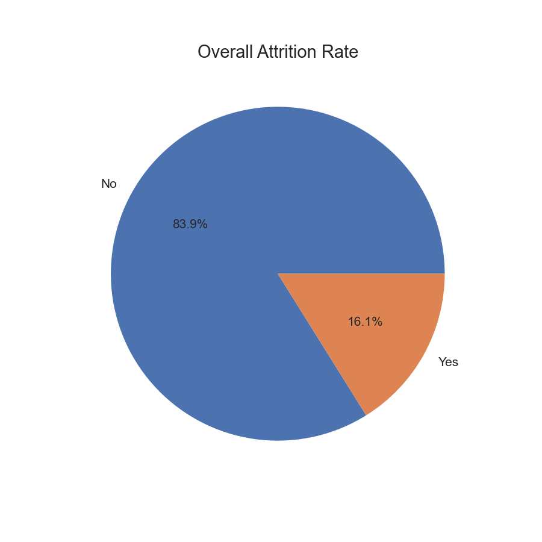
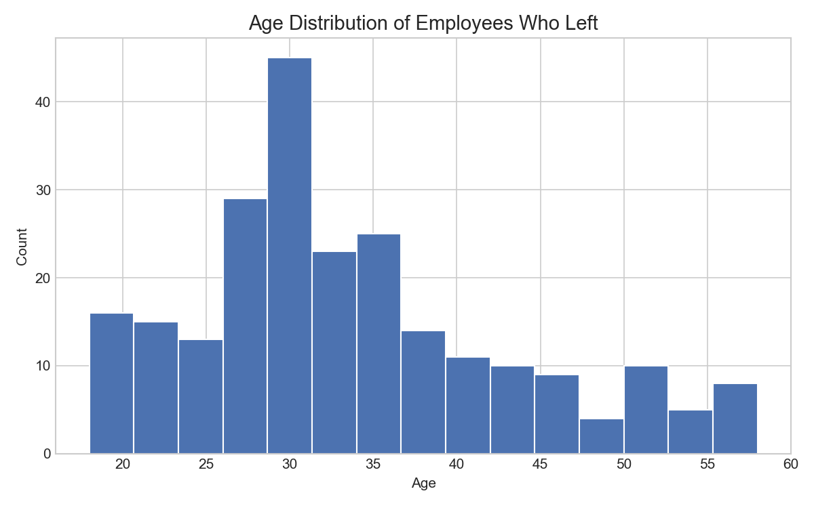
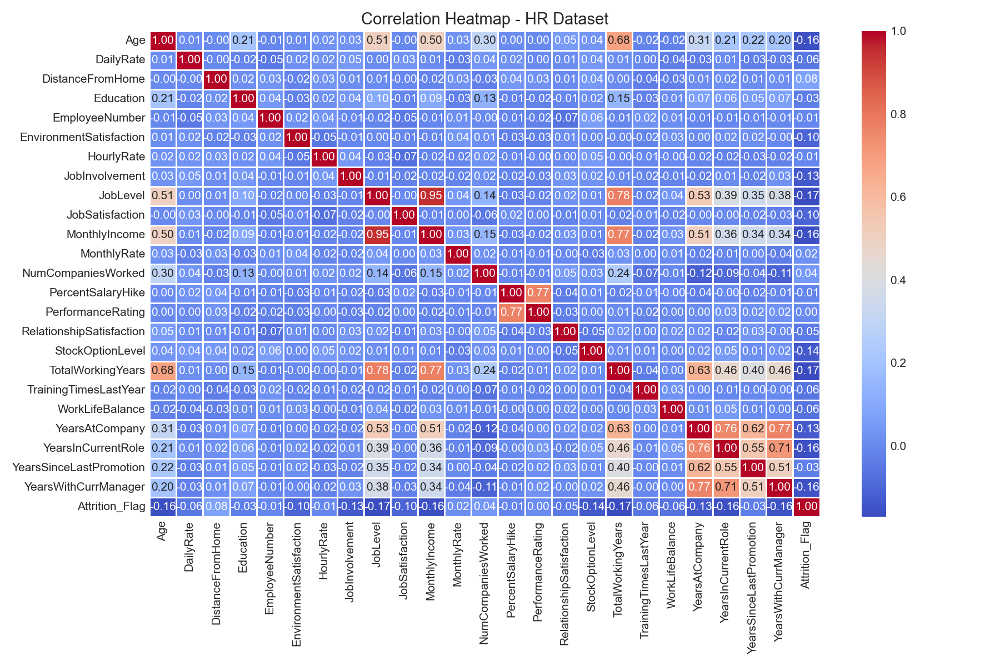
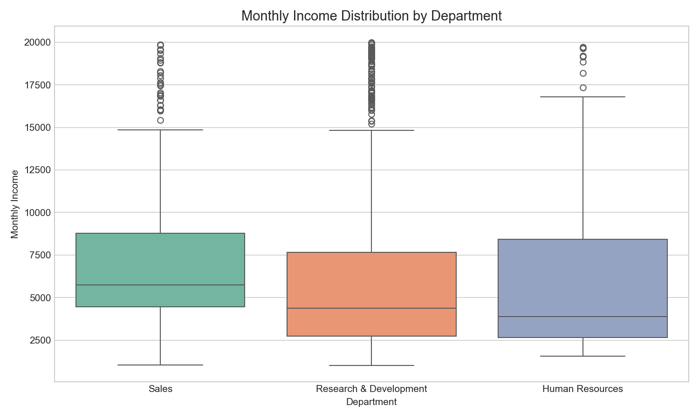

<!-- HERO -->

  

# HR Employee Attrition Analysis

TL;DR

This project analyzes the IBM HR Employee Attrition dataset to identify patterns and drivers of employee turnover using Python (pandas, NumPy), EDA, and feature engineering. Key findings include: higher attrition among employees working overtime, notable age-group differences with younger employees showing elevated attrition, and strong relationships between monthly income, job level, and total working years. The repository contains the original notebook, cleaned data, and static visualizations.

Quickstart (run in project root)

1. Recommended Python: 3.8 or newer
2. Create and activate a virtual environment (example):

   python -m venv .venv
   .\.venv\Scripts\activate

3. Install dependencies (if requirements.txt present):

   pip install -r requirements.txt

How to reproduce the analysis

- Open notebook/HR_Attrition_Analysis.ipynb in Jupyter and run the cells in order to reproduce the exploratory analysis and regenerate outputs in outputs/. Alternatively, execute the notebook programmatically with:

  jupyter nbconvert --to notebook --execute notebook/HR_Attrition_Analysis.ipynb --output executed_notebook.ipynb

Dataset & citation

- Dataset: IBM HR Employee Attrition Dataset (WA_Fn-UseC_-HR-Employee-Attrition.csv)
- Original source: Kaggle — pavansubhasht (Pavan Subhash)
- Source URL: https://www.kaggle.com/datasets/pavansubhasht/ibm-hr-analytics-attrition-dataset
- Licensing note: The dataset is hosted on Kaggle and may be subject to platform-specific or contributor-specific terms. This repository does NOT redistribute the dataset. To reproduce this analysis, download the CSV from the original source and place it in data/ with the exact filename: WA_Fn-UseC_-HR-Employee-Attrition.csv. Example (requires Kaggle CLI and an account):

kaggle datasets download -d pavansubhasht/ibm-hr-analytics-attrition-dataset -f WA_Fn-UseC_-HR-Employee-Attrition.csv -p data/ --unzip

Verify the dataset license on the Kaggle page before commercial use.

Contact & skills

- Author: Naziyafirdoz
- Skills demonstrated: exploratory data analysis, data cleaning, feature engineering, visualization, and business-focused insights.

---

# HR Employee Attrition Analysis

## Consulting-style Introduction

Business question: Why are employees leaving and which levers can reduce turnover fastest and most cost-effectively?

This engagement applies exploratory data analysis and pragmatic feature engineering to the IBM HR Employee Attrition dataset to uncover patterns of turnover and highlight priority interventions. The goal is to present HR and business stakeholders with clearly supported findings, quantifiable risk segments, and actionable next steps they can pilot quickly.

The analysis focuses on: data-driven segment identification, simple interpretable features, and visual storytelling designed for stakeholder decision-making.

---

## Dataset

Dataset: IBM HR Employee Attrition Dataset

Rows: 1470

Columns: 35

After cleaning: 32 columns

---

## Tools & Libraries

- Python
- Pandas
- NumPy
- Matplotlib
- Seaborn
- Jupyter Notebook

---

## Project Workflow

1. Data Loading
2. Data Understanding
3. Data Cleaning
4. Feature Engineering
5. Core Analysis (GroupBy)
6. Advanced Analysis
7. Visualization
8. Business Insights

---

## Visualizations

Below are the key static visualizations generated from the analysis (files in visuals/). Click images to view full-size.

  

  

  

  

  

---

## Key Business Insights

### 1. Department Attrition

Finding: Research & Development has the highest raw attrition count (133 employees) in the dataset.

Business impact: High attrition in R&D can slow product development and increase recruitment costs for specialized roles. Prioritize root-cause investigations in R&D (workload, career ladders, manager effectiveness) and pilot retention measures there to yield outsized business benefit.

### 2. Overtime Impact

Finding: Employees who report working overtime show markedly higher attrition (~30%) compared to those not working overtime (~10%).

Business impact: Overtime appears to be a strong risk signal. Reducing chronic overtime (staffing adjustments, task reprioritization, flexible scheduling) could lower turnover and reduce burnout-driven costs; quantify potential savings by estimating replacement costs per role.

### 3. Age Group Analysis

Finding: Younger employees exhibit elevated attrition rates relative to mid-career or senior cohorts.

Business impact: Early-career departures suggest onboarding, career-pathing, or role-fit issues. Implement targeted early-career programs (mentoring, clearer promotion pathways) to improve retention of high-potential talent.

### 4. Salary & Job Role

Finding: Monthly income correlates with JobLevel and TotalWorkingYears; managers and research directors earn more than operational roles.

Business impact: Compensation alignment affects retention — review pay competitiveness for high-turnover roles. Consider targeted compensation reviews or non-monetary retention levers (career development) where budget is constrained.

### 5. High-Risk Employees

Finding: The combination of overtime and low job satisfaction identifies a high-risk cohort for attrition (the project flags these as "High Risk").

Business impact: A focused intervention (stay interviews, workload audits, manager coaching) for this small high-risk group can be a cost-effective way to reduce near-term churn.

### 6. Correlation Findings

Finding: A correlation heatmap shows strong relationships between MonthlyIncome, JobLevel, and TotalWorkingYears; other relationships are weaker and require controlled analysis.

Business impact: Some apparent relationships (like income and job level) are structurally expected; use controlled models (regression) when proposing causal actions. Prioritize interpretable analyses before large policy changes.

---

## Business Recommendations

- Reduce overtime burden
- Improve career growth opportunities
- Review compensation structures
- Strengthen employee engagement programs

---

## Project Outcomes

Deliverables included in this repository:

- Cleaned dataset: outputs/cleaned_hr_data.csv (ready for modeling or dashboarding)
- Visual assets: visuals/*.png (stakeholder-ready figures)
- Exploratory notebook: notebook/HR_Attrition_Analysis.ipynb (annotated analysis and group-by summaries)
- Department-level summary: outputs/dept_attrition_summary.csv

How this helps stakeholders:

- Ready-to-share visuals and a cleaned dataset accelerate follow-up work (modeling, dashboards, or HR experiments).
- Actionable, prioritized recommendations allow HR to run focused pilots (e.g., overtime reduction in R&D or targeted retention for early-career hires).

## Future Improvements

Recommended next steps to elevate this analysis for production or client delivery:

1. Reproducibility & automation: add a requirements.txt or environment.yml and a small run script to regenerate outputs programmatically.
2. Statistical validation: implement controlled analyses (logistic regression or matched comparisons) to quantify adjusted effects and confidence intervals.
3. Interpretability: add feature-importance methods (e.g., SHAP or permutation importance) for any predictive models to support explainable decisions.
4. Client deliverables: produce a one-page executive summary PDF and a short slide deck tailored to HR or leadership audiences.
5. Interactive delivery: build a simple Streamlit dashboard or provide a Binder/Colab link for interactive exploration.

These improvements are optional but will move the project from exploratory to production-ready and more compelling for recruiters and freelance clients.

---

## Project Structure

hr-employee-attrition-analysis/

├── notebook/

│ └── HR_Attrition_Analysis.ipynb

├── data/

│   └── (dataset not included; see README dataset section)

├── outputs/

│ ├── cleaned_hr_data.csv

│ └── dept_attrition_summary.csv

├── visuals/

│ ├── attrition_by_dept.png

│ ├── attrition_rate_pie.png

│ ├── age_distribution.png

│ ├── correlation_heatmap.png

│ └── salary_boxplot.png

└── README.md

